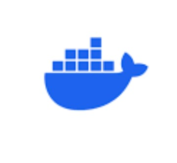
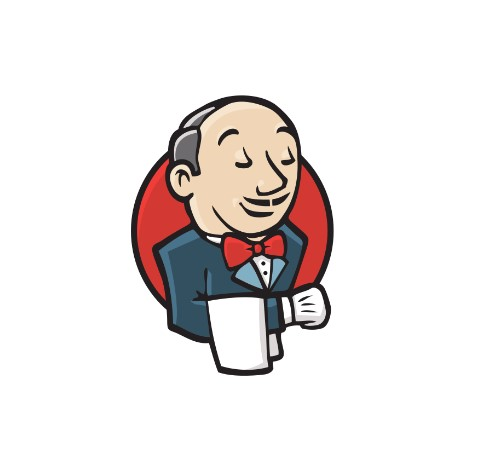
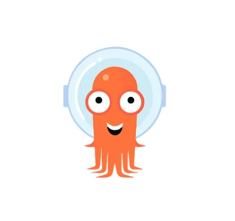

<h2 style="text-align: center;">frequently used Tools</h2>

    

        <!-- GCP -->
        

            
            <h4 class="service-heading">
GCP
</h4>
            
Click to view details

            

                

                    GCP의 다양한 서비스를 활용하여 인프라를 구축하고 관리할 수 있습니다.
                     IAM을 이용하여 보안을 강화하고 리소스에 접근하는 권한을 제어할 수 있습니다.
                

            

        

        <!-- Docker -->
        

            
            <h4 class="service-heading">
Docker
</h4>
            
Click to view details

            

                

                    Docker 컨테이너 기술을 이용하여 애플리케이션을 구성하고 배포할 수 있습니다.
                

            

        

        <!-- Kubernetes -->
        

            
            <h4 class="service-heading">
Kubernetes
</h4>
            
Click to view details

            

                

                    Kubernetes 클러스터를 구성하여 애플리케이션을 배포하고 관리할 수 있습니다.
                    스케일링과 업데이트 정책을 설정하여 서비스의 안정적인 애플리케이션 배포를 수행할 수 있습니다.
                

            

        

        <!-- Linux -->
        

            
            <h4 class="service-heading">
Linux
</h4>
            
Click to view details

            

                

                    Linux CLI를 이용하여 파일 및 디렉토리 관리와 소프트웨어 설치, 시스템 설정 등을 수행할 수 있습니다.
                    원격 서버에 SSH를 통해 접속하여 원격 작업을 처리할 수 있습니다. 
                

            

        

        <!-- Terraform -->
        

            
            <h4 class="service-heading">
Terraform
</h4>
            
Click to view details

            

                

                    Terraform을 이용하여 클라우드 인프라를 배포하고 관리할 수 있습니다. 
                    원격 파일 저장소를 구성해 버전을 관리하고 변경 사항을 추적할 수 있습니다.
                

            

        

        <!-- Visual Studio Code -->
        

            
            <h4 class="service-heading">
Visual Studio Code
</h4>
            
Click to view details

            

                

                    VS Code를 사용하여 효율적으로 코드를 작성 및 관리할 수 있습니다.
                

            

        

    

 
 
<h2 style="text-align: center;">Experienced Tools</h2>

<!-- Second Container (New) -->

    

        <!-- New Skill 1 -->
        

            
            <h4 class="service-heading">
AWS
</h4>
        

        <!-- New Skill 2 -->
        

            
            <h4 class="service-heading">
NGINX
</h4>
        

        <!-- New Skill 3 -->
        

            
            <h4 class="service-heading">
Apache
</h4>
        

        <!-- New Skill 4 -->
        

            
            <h4 class="service-heading">
Jenkins  
</h4>
        

        <!-- New Skill 5 -->
        

            
            <h4 class="service-heading">
ArgoCD
</h4>
        

        <!-- New Skill 6 -->
        

            
            <h4 class="service-heading">
Github
</h4>
        

    

